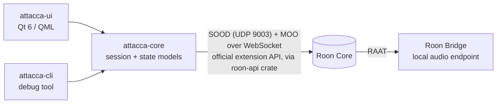

# Attacca

**A native Roon client for Linux.** Roon ships desktop clients for Windows and macOS, but Linux users only get the headless Roon Server and Roon Bridge — the community has been asking for a GUI [since 2017](https://community.roonlabs.com/t/linux-roon-control-gui-please-not-on-roadmap-you-may-try-to-use-wine/23081). Attacca aims to be the daily-driver client Linux never got: browse your library and TIDAL/Qobuz, control every zone, and play to the machine it runs on.

*Attacca* (It., music): proceed to the next movement without pause.

> **Status: working alpha.** Qt 6/QML desktop app with Now Playing, full
> browse/search (library, TIDAL, Qobuz), live queue with click-to-jump, zone
> grouping, shuffle/repeat/Roon Radio, keyboard shortcuts, and an MPRIS2 bridge
> (media keys / desktop widgets). Daily-driven against Roon 2.70 on KDE/Wayland.
> Expect rough edges; the guided Roon Bridge setup is not built yet.

## Architecture



- **Control plane**: Roon's official, Apache-2.0-licensed extension API (the protocol behind [node-roon-api](https://github.com/RoonLabs/node-roon-api)), via the [`roon-api`](https://crates.io/crates/roon-api) Rust SDK. The Core is discovered via SOOD multicast; its SOOD response advertises the MOO/WebSocket port (`http_port`).
- **Audio plane**: a locally running [Roon Bridge](https://help.roonlabs.com/portal/kb/articles/linux-install) makes this machine a first-class RAAT zone. Attacca will offer a guided setup that downloads Bridge from Roon's servers (Roon's terms do not permit bundling it).
- **UI**: Qt 6 / QML — GPU scene graph, virtualized grids for large artwork libraries, first-class Wayland fractional scaling.

## What it can and cannot become

Built on the official API (see [research.md](research.md) for the fully sourced analysis):

| Works | Out of reach (API ceiling) |
|---|---|
| Transport, zones, grouping, volume | Queue editing (only "play from here") |
| Live queue + now-playing display | Playlist creation/editing |
| Library, TIDAL & Qobuz browsing, search | DSP configuration, signal path |
| Artwork, internet radio | Daily Mixes / Home recommendations, metadata editing |

Attacca is honest about being a very capable client, not a 1:1 clone of the native app.

## Requirements

- A **Roon Core** on your network and an active Roon subscription.
- **Qt 6** (`qt6-base`, `qt6-declarative`, `qt6-svg`) and a **Rust** toolchain.
- For playback *on this machine*: a running [Roon Bridge](https://help.roonlabs.com/portal/kb/articles/linux-install).
  Attacca controls any zone without it — Bridge is only what makes this
  computer itself an endpoint. Installing it is manual for now (see Roadmap).

The package installs two binaries: **`attacca`** is the desktop app;
**`attacca-cli`** is a diagnostic tool you will probably never need.

## Install

**Arch and derivatives.** The PKGBUILD is self-contained — it clones this
repository itself, so you do not need the source to build it:

```sh
curl -O https://raw.githubusercontent.com/styx-techno/attacca/main/packaging/aur/PKGBUILD
makepkg -si
```

> Not on the AUR yet: new AUR account registration is currently closed
> following the 2025 malware incidents. The PKGBUILD above is the same one
> that will be submitted once registration reopens.

**From source, any distro** (user scope):

```sh
cargo build --release -p attacca-ui -p attacca-cli
install -Dm755 target/release/attacca ~/.local/bin/attacca
install -Dm755 target/release/attacca-cli ~/.local/bin/attacca-cli
install -Dm644 packaging/attacca.desktop ~/.local/share/applications/attacca.desktop
install -Dm644 packaging/attacca.svg ~/.local/share/icons/hicolor/scalable/apps/attacca.svg
```

Flatpak: `packaging/flatpak/` (untested skeleton; cargo sources need vendoring).

## First run

Launch `attacca`, then approve **Attacca** in Roon's
**Settings → Extensions**. The Core is found automatically over SOOD multicast.
Pairing tokens are stored in `~/.config/attacca/tokens.json`.

> If registration seems to hang, it is almost always waiting for that approval.
> Note that adding a newly required service to an existing install invalidates
> the previous grant, so you may need to re-enable the extension after upgrades.

Shortcuts: `Space` play/pause · `Ctrl+←/→` previous/next · `Ctrl+F` search · `Esc` back.

## Diagnostic CLI

`attacca-cli` pairs as its own extension (`org.attacca.cli`), so it never fights
the running app over the Core connection:

```sh
attacca-cli --help              # full usage
attacca-cli discover            # list Cores on the LAN, with host/port/version
attacca-cli                     # pair + watch zone events
attacca-cli toggle kitchen      # play/pause a zone by name substring
```

Useful when the app cannot find your Core: `discover` shows whether SOOD
replies are arriving at all, which is the usual failure when a Roon Bridge on
the same machine is holding the discovery port.

## Development

`vendor/roon-api` is a patched copy of the upstream crate — it adds the queue
subscription calls (`subscribe_queue`, `play_from_here`) that upstream does not
implement yet. See [`vendor/roon-api/VENDORED.md`](vendor/roon-api/VENDORED.md);
the plan is to upstream it and drop the patch.

For QML language-server support in your editor, create an untracked
`crates/attacca-ui/.qmlls.ini` pointing at your own checkout — the path must be
absolute, which is why it is not committed:

```ini
[General]
buildDir="/absolute/path/to/attacca/target/cxxqt/qml_modules"
no-cmake-calls=true
```

## Roadmap

1. ✅ Protocol spike: discover, pair, subscribe, control
2. ✅ Now Playing + zone picker + volume (QML)
3. ✅ Browse: artwork grid, search, play actions (TIDAL/Qobuz included)
4. ✅ Queue view, keyboard shortcuts, MPRIS2 bridge, icons/backdrop polish
5. ✅ Zone grouping UI, shuffle/repeat/Roon Radio, single-instance handling
6. Guided Roon Bridge setup (waiting for Roon's .NET 10 Bridge, 2026-08-30;
   PipeWire coexistence via `plug:pipewire`)
7. Flatpak/AUR publication, forum announcement
8. Upstream the queue protocol support to [shin1ohno/roon-rs](https://github.com/shin1ohno/roon-rs)

## Legal

Attacca is an independent community project, not affiliated with, endorsed by, or supported by Roon Labs LLC or Harman International. "Roon" is a trademark of Roon Labs LLC. Attacca uses only Roon's publicly published extension API and does not redistribute any Roon software. A Roon subscription and a Roon Core on your network are required.

License: [MIT](LICENSE).
