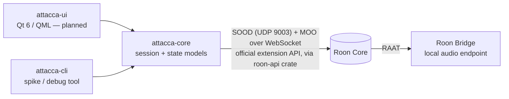

# Attacca

**A native Roon client for Linux.** Roon ships desktop clients for Windows and macOS, but Linux users only get the headless Roon Server and Roon Bridge — the community has been asking for a GUI [since 2017](https://community.roonlabs.com/t/linux-roon-control-gui-please-not-on-roadmap-you-may-try-to-use-wine/23081). Attacca aims to be the daily-driver client Linux never got: browse your library and TIDAL/Qobuz, control every zone, and play to the machine it runs on.

*Attacca* (It., music): proceed to the next movement without pause.

> **Status: week-1 protocol spike.** Discovery, pairing, zone subscription, and transport control against a live Core. No UI yet.

## Architecture



- **Control plane**: Roon's official, Apache-2.0-licensed extension API (the protocol behind [node-roon-api](https://github.com/RoonLabs/node-roon-api)), via the [`roon-api`](https://crates.io/crates/roon-api) Rust SDK. The Core is discovered via SOOD multicast; its SOOD response advertises the MOO/WebSocket port (`http_port`).
- **Audio plane**: a locally running [Roon Bridge](https://help.roonlabs.com/portal/kb/articles/linux-install) makes this machine a first-class RAAT zone. Attacca will offer a guided setup that downloads Bridge from Roon's servers (Roon's terms do not permit bundling it).
- **UI (planned)**: Qt 6 / QML — GPU scene graph, virtualized grids for large artwork libraries, first-class Wayland fractional scaling.

## What it can and cannot become

Built on the official API (see [research.md](research.md) for the fully sourced analysis):

| Works | Out of reach (API ceiling) |
|---|---|
| Transport, zones, grouping, volume | Queue editing (only "play from here") |
| Live queue + now-playing display | Playlist creation/editing |
| Library, TIDAL & Qobuz browsing, search | DSP configuration, signal path |
| Artwork, internet radio | Daily Mixes / Home recommendations, metadata editing |

Attacca is honest about being a very capable client, not a 1:1 clone of the native app.

## Try the spike

```sh
cargo run -p attacca-cli -- discover          # list Cores on the LAN
cargo run -p attacca-cli --                   # pair + watch zones (approve "Attacca"
                                              #   in Roon Settings → Extensions on first run)
cargo run -p attacca-cli -- toggle wohnzimmer # play/pause a zone by name substring
```

Pairing tokens are stored in `~/.config/attacca/tokens.json`.

## Roadmap

1. ✅ Protocol spike: discover, pair, subscribe, control
2. Now Playing + zone picker + volume (QML)
3. Browse: artwork grid, search, play actions
4. Guided Roon Bridge setup (PipeWire coexistence via `plug:pipewire`)
5. Flatpak + AUR packaging, forum announcement

## Legal

Attacca is an independent community project, not affiliated with, endorsed by, or supported by Roon Labs LLC or Harman International. "Roon" is a trademark of Roon Labs LLC. Attacca uses only Roon's publicly published extension API and does not redistribute any Roon software. A Roon subscription and a Roon Core on your network are required.

License: [MIT](LICENSE).
